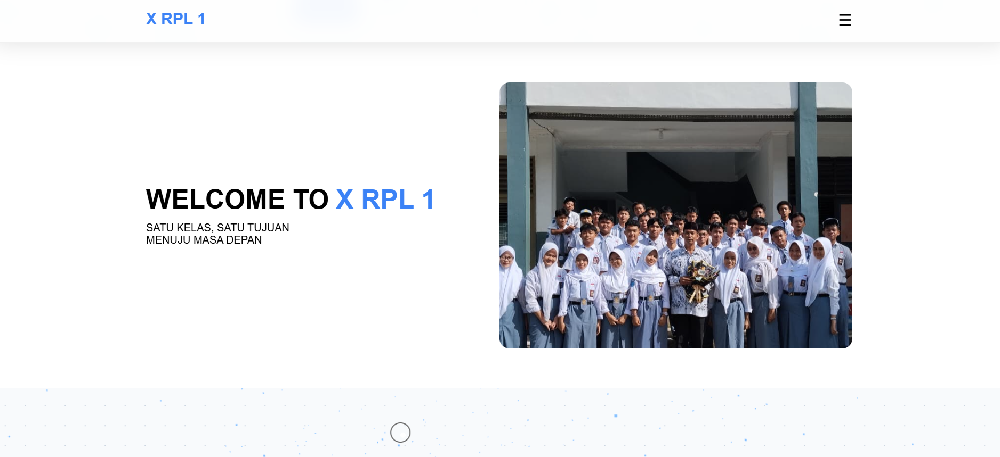
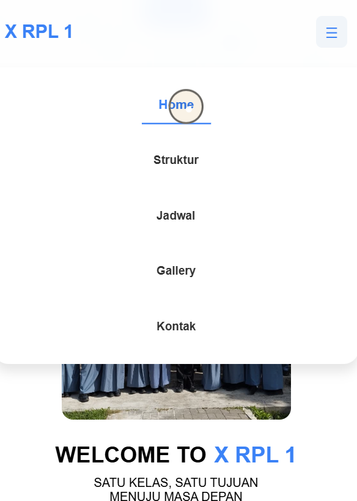
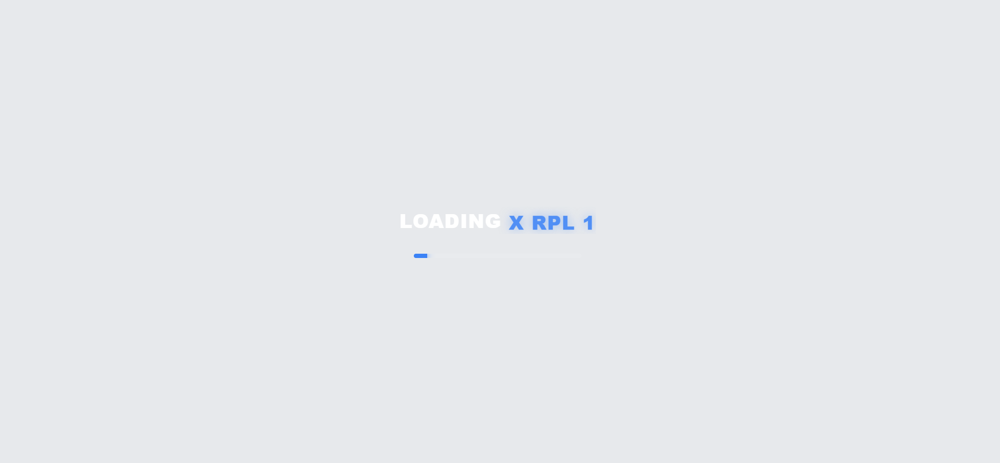
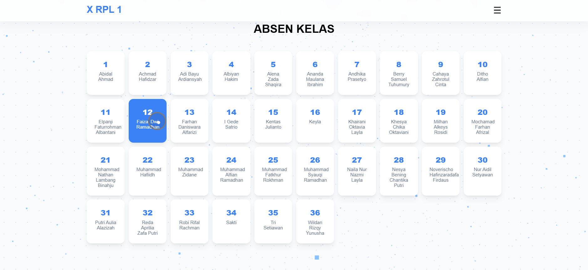

## 🌐 Website Kelas X RPL 1

**📌 Deskripsi**

Website Kelas X RPL 1 adalah website berbasis front-end yang dibuat untuk menampilkan informasi seputar kelas, seperti profil kelas, anggota, dan informasi lainnya. Website ini bertujuan untuk menjadi media informasi digital yang sederhana, rapi, dan mudah diakses.

---

**🎯 Tujuan**

- Menyediakan informasi tentang kelas X RPL 1
- Menjadi media dokumentasi digital kelas
- Melatih kemampuan dalam pengembangan web (HTML, CSS, JavaScript)
- Menerapkan struktur project yang rapi dan profesional

---

**🧩 Fitur Utama**

- ✅ Navbar navigasi
- ✅ Halaman utama (Home)
- ✅ Profil kelas
- ✅ Informasi anggota kelas
- ✅ Desain responsive
- ✅ Interaksi sederhana menggunakan JavaScript

---

**🛠️ Teknologi yang Digunakan**

- HTML5
- CSS3
- JavaScript

---

**📁 Struktur Project**

```plaintext
WebsitePAHAP/
├── docs/
│   ├── planning.md
│   ├── design.md
│   └── testing.md
├── assets/
│   ├── css/
│   ├── img/
│   └── js/
├── index.html
└── README.md
```

---

**🖼️ Preview**

### Home


### NavBar


### LoadingScreen


### Abcent


---

**🚀 Cara Menjalankan**

1. Download atau clone project ini
2. Buka folder project
3. Jalankan file "index.html" di browser

---

**🧪 Testing**

Pengujian dilakukan untuk memastikan:

- Website berjalan tanpa error
- Navigasi berfungsi dengan baik
- Tampilan responsive di berbagai perangkat

Detail lengkap dapat dilihat pada "docs/testing.md"

## 🌐 Live Demo
https://xrpl1smkn4tangerang-paha.netlify.app

---

**📚 Dokumentasi**

Dokumentasi lengkap tersedia pada folder "docs/":

- Planning
- Design
- Testing

---

**👨‍💻 Developer**

Project ini dibuat oleh:
Faizal Dwi Ramadhan 
Muhammad Hafidh 
Kelas X RPL 1

---

**📌 Catatan**

Website ini masih dapat dikembangkan lebih lanjut, seperti penambahan fitur backend atau database di masa depan.