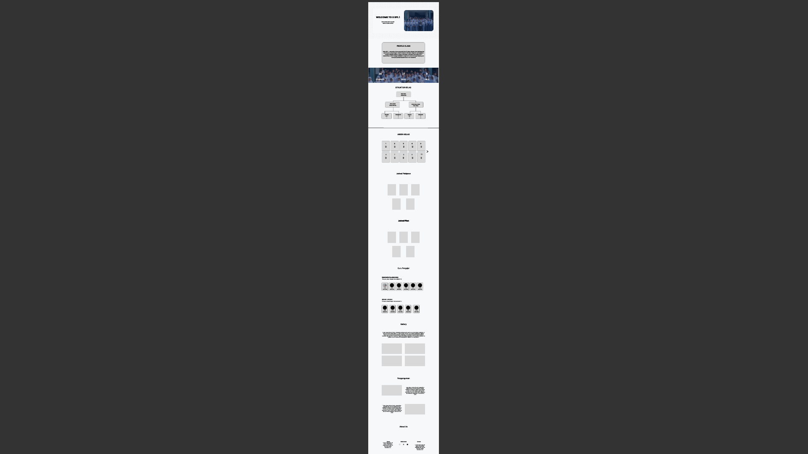

## DESIGN DOCUMENT

---
1. **Overview**
---

Dokumen ini menjelaskan perancangan tampilan (UI) dan pengalaman pengguna (UX) dari Website PAHA. Fokus utama desain adalah kesederhanaan, kemudahan navigasi, dan tampilan yang responsif di berbagai perangkat.

---
2. **Design Goals**
---

Tujuan desain website ini adalah:

- Membuat tampilan yang sederhana dan mudah dipahami
- Memastikan navigasi jelas dan tidak membingungkan
- Mengoptimalkan tampilan untuk desktop dan mobile (responsive)
- Memberikan pengalaman pengguna yang nyaman

---
3. **Layout Structure**
---

Struktur halaman website terdiri dari beberapa bagian utama:

- Navbar
  Berisi menu navigasi seperti Home, About, dan lainnya untuk memudahkan perpindahan antar section.

- Hero Section
  Bagian awal yang menampilkan judul utama dan deskripsi singkat website.

- Content Section
  Berisi informasi utama yang disusun dalam beberapa bagian agar mudah dibaca.

- Footer
  Berisi informasi tambahan seperti copyright atau kontak.

Wireframe ini menggambarkan dan mendesain dari awal atau rancangan sebelum kita membangun websitenya.

Berikut gambaran sederhana tata letak halaman:

- Bagian atas: Navbar
- Di bawah navbar: Hero section (judul + deskripsi)
- Bagian tengah: Konten utama (informasi)
- Bagian bawah: Footer

## Wireframe

---
4. **Color Scheme**
---

Warna yang digunakan dalam website:

- Warna utama: Biru (kesan profesional dan tenang)
- Warna sekunder: Putih (bersih dan sederhana)
- Warna tambahan: Abu-abu (untuk teks atau elemen pendukung)

---
5. **Typography**
---

Penggunaan font dalam website:

- Judul: Font tegas dan mudah dibaca
- Isi: Font sederhana untuk kenyamanan membaca
- Ukuran font disesuaikan agar tetap terbaca di berbagai perangkat

---
6. **Responsive Design**
---

Website dirancang agar dapat menyesuaikan tampilan pada:

- Desktop
- Tablet
- Mobile

Teknik yang digunakan:

- Flexbox / Grid
- Media Queries

---
7. **User Flow**
---

Alur pengguna saat menggunakan website:

1. Pengguna membuka website
2. Melihat informasi utama di halaman Home
3. Menggunakan navbar untuk berpindah section
4. Membaca informasi yang tersedia
5. Selesai menggunakan website

---
8. **Tools**
---

Tools yang digunakan dalam perancangan:

- Visual Studio Code (coding)
- Browser (testing tampilan)
- Figma (desain)
- GitHub(Taro code)
- Whatsapp(Berinteraksi)

---
9. **Accessibility (Opsional)**
---

Upaya yang dilakukan untuk meningkatkan aksesibilitas:

- Penggunaan warna yang kontras
- Ukuran teks yang cukup besar
- Navigasi yang mudah digunakan